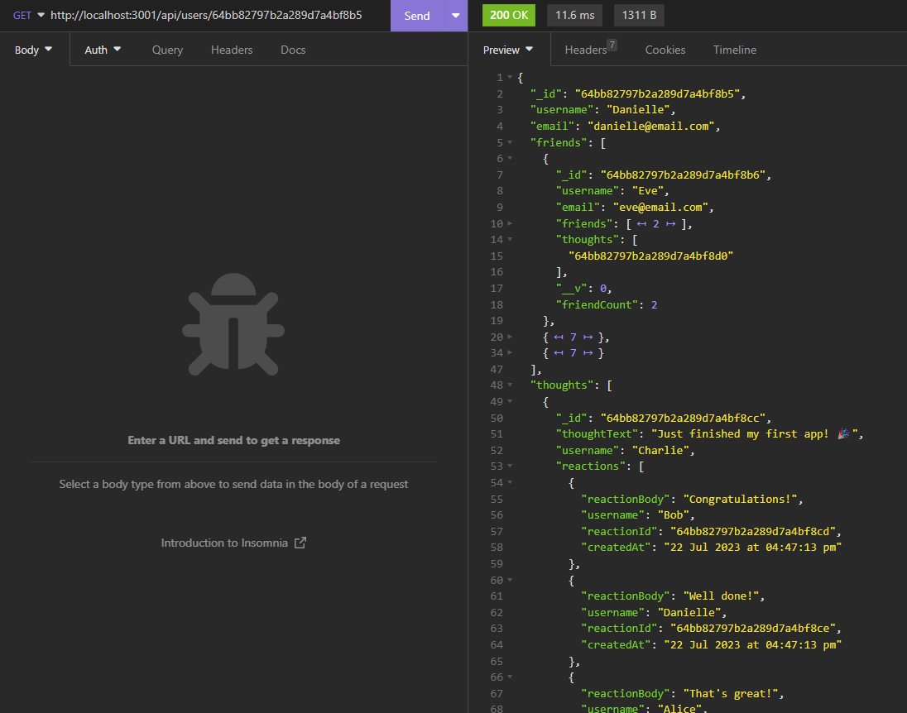

# Mind-Chain Musings

## Description

[](https://opensource.org/licenses/MIT)

A social network api using a NoSQL data model

## Table of Contents

- [Overview](#overview)
- [Technologies Used](#technologies-used)
- [Usage](#usage-and-demo)
- [Installation](#installation)
- [License](#license)
- [Author](#author)
- [Acknowledgments](#acknowledgments)
- [Contributing](#contributing)

## Overview

This is a social network api that uses a NoSQL data model. It allows the application user to create/update/delete users, add/delete users to a user's friends list, create/update/delete user Thoughts, and create/delete Reactions to Thoughts. The application user can also view all users, all thoughts, and a single user or thought by the unique id.

## Technologies Used

JavaScript in a Node.js environment, using Express.js for the server, Mongoose for accessing the MongoDB database, and Dayjs for date formatting.

## Usage and Demo

This application is not deployed, but can be run locally by following the installation process below. Once the application is running, the user can use Insomnia, Postman or curl to test the api routes, or use them in their own application.

Here is a link to a video demonstrating the api routes in Insomnia:

Video Link: [Mind-Chain Musings](https://drive.google.com/file/d/1RmCt2PKMkoqc6ZETbNPkceWNaLfz-ISG/view?usp=sharing)

Screenshot of the application retrieving a User in Insomnia:



The API routes are as follows, adding to your base server url. Examine the code and model to see what body data is required for each route.:

```
http://yourserverroute/ eg http://localhost:3001/
```

### User Routes

```
GET ../api/users - returns all users
GET ../api/users/populated - returns all users with their friends and thoughts
GET ../api/users/:userId - returns a single user by id with their friends and thoughts
POST ../api/users - creates a new user
PUT ../api/users/:userId - updates a user by id
DELETE ../api/users/:userId - deletes a user by id

POST ../api/users/:userId/friends/:friendId - adds a friend to a user friends list
DELETE ../api/users/:userId/friends/:friendId - deletes a friend from a user friends list
```

### Thought Routes

```
GET ../api/thoughts - returns all thoughts
POST ../api/thoughts - creates a new thought for a user by id
GET ../api/thoughts/:thoughtId - returns a single thought by id
PUT ../api/thoughts/:thoughtId - updates a thought by id
DELETE ../api/thoughts/:thoughtId - deletes a thought by id
```

#### Reaction Routes

```
POST ../api/thoughts/:thoughtId/reactions - adds a reaction to a thought by thought id
DELETE ../api/thoughts/:thoughtId/reactions - deletes a reaction from a thought
```

## Installation

1. Clone the Repository from GitHub
2. Open the cloned repository in your source code editor.
3. Open the integrated terminal of the document and run the following command to install the required dependencies:

```bash
npm install
```

4. Create a .env file in the root directory of the application and add the following code, replacing the placeholder with your own MongoDB database name:

```
MONGODB_URI=mongodb://127.0.0.1:27017/mindchain
```

5. Run the following command in the terminal to start the server:

```bash
npm start
```

6. Use Insomnia, Postman or curl to test the api routes, or use them in your own application.

## License

This application is covered under the MIT license. Please refer to the document titled [LICENSE](LICENSE).

## Author

This application was written and developed by [Rene Malingre](https://github.com/ReneMalingre)

## Acknowledgments

Microsoft for [Visual Studio Code](https://code.visualstudio.com/)
Mongoose for [Mongoose](https://mongoosejs.com/)
Express.js for [Express.js](https://expressjs.com/)
Day.js for [Day.js](https://day.js.org/)
MongoDB for [MongoDB](https://www.mongodb.com/)
Node.js for [Node.js](https://nodejs.org/en/)

## Contributing

This project is not accepting contributions at this time. Fill free to fork or clone for your own use.
